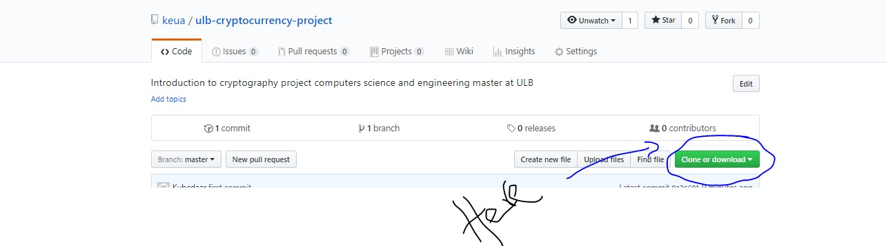
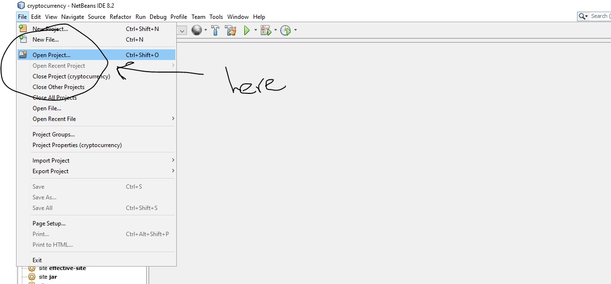
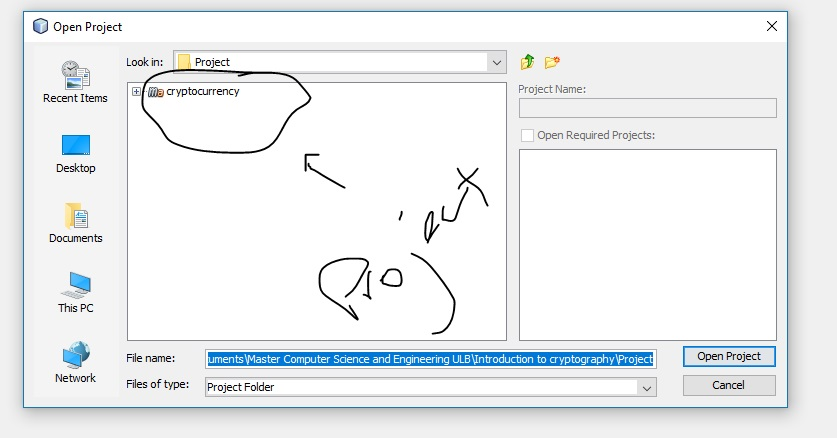
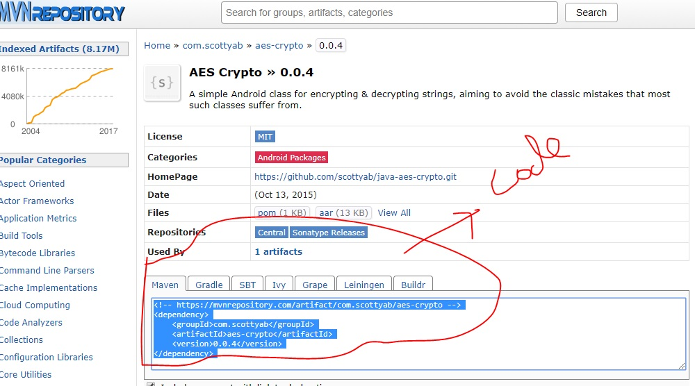
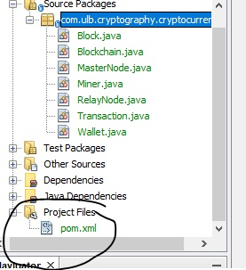

# ulb-cryptocurrency-project

## Create github account and install git

The first thing you have to do is create and account in the github website.  
[How to create an account in gihub](http://product.hubspot.com/blog/git-and-github-tutorial-for-beginners)

when you have created the account and installed git in your computer.

You can download the project in this page if your an expert you can clone from the terminal:
> https://github.com/keua/ulb-cryptocurrency-project



`you have to decompress the file you have downloaded.`

## Open the project

To open the project you need to install Netbeans 8.2, [download here](https://netbeans.org/downloads/?pagelang=pt_BR)

`download the complete version.`

Open the program and then chose the open project option:



Go wherever you have decompress the project, you should see something like this:



`You can learn how Netbeans work`  [here](https://netbeans.org/kb/docs/java/quickstart.html)

## Project structure
```

├── com.ulb.cryptography.cryptocurrency
│   ├── Block.java
│   ├── Blockchain.java
│   ├── MasterNode.java
│   ├── Miner.java
│   ├── RelayNode.java
│   ├── Transaction.java
|   ├── Wallet.java
```

## Libraries

To add libraries or plugins we will use the MAVEN repository, you can learn more about it [here](https://maven.apache.org/pom.html)

To add a plugion or library, you have to find it in the MAVEN respository [here](https://mvnrepository.com/)



That code should be added to the POM.xml file



## Save changes in the git repository

If you want to save a version of your code you have to push your changes to the central repository.  
`You have to publish in the whatsapp group you username of the github account to give you writing rights to the central respository.`

If you have questions please publish them in the group and the people who know the tools can answer you.